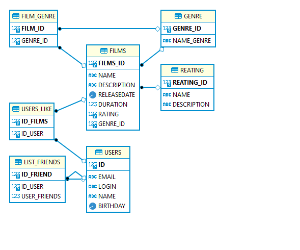

# Схема базы данных

**films**
Содержит данные о фильме
##### В таблицу входят поля:
* id  - первичный ключ 
* ganre_id внешний ключ жанра 
* name - название фильма 
* description - описание фильма
* releaseDate - дата релиза 
* duration - продолжительность 
* likes - количество лйаков
* rating - рейтинг

**users**
Содержит данные о пользователях
##### В таблицу входят поля:
* id - первичный ключ
* email - адрес электронной почты 
* login - логин
* name - имя
* birthday - дата рождение 
* friends - список друзей 

**list_friends**
Содержит данные друзьях пользователях
##### В таблицу входят поля:
* id_user - id пользователя 
* id_friend - id друга 

**genre_film**
Содержит данные о жанрах фильма
##### В таблицу входят поля:
* id - id жанра первичный ключ
* name - название жанра

**users_like**
Содержит данные о лайках пользователя
##### В таблицу входят поля:
* В таблицу входят поля:
* id_user - id пользователя 
* id_films - id фильма 

**reating**
Содержит данные о рейтенге
##### В таблицу входят поля:
id - id Фильма
name - Название рейтинга